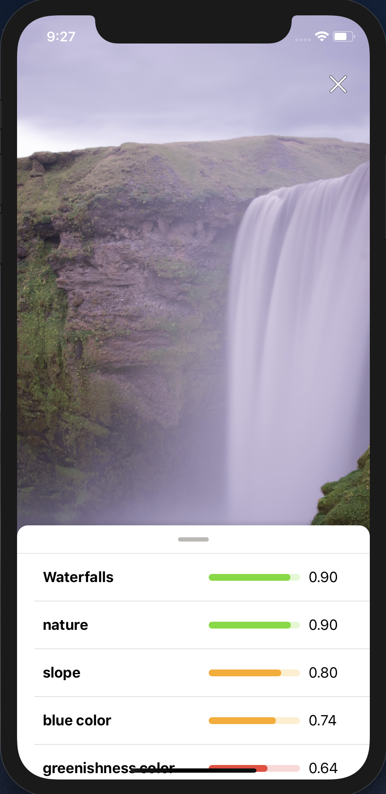
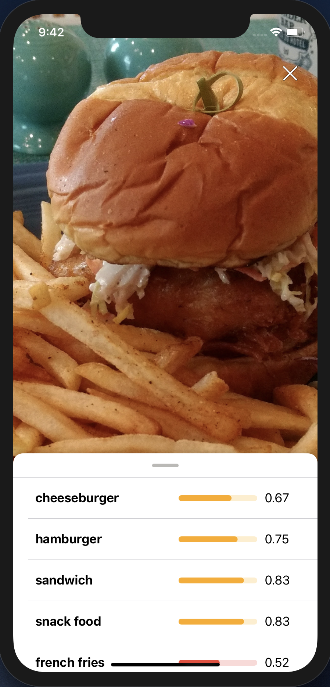
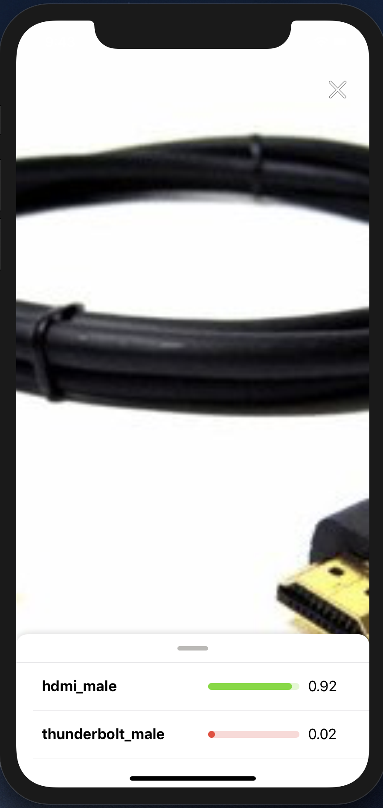

# Create an iOS app that uses built-in and custom Watson Visual Recognition classifiers

This is an iOS application that showcases various out of the box classifier available with the Watson Visual Recognition service on IBM Cloud. 

This app has support for the following features of Watson Visual Recognition:

* [General](https://cloud.ibm.com/apidocs/visual-recognition#classify-an-image): Watson Visual Recognition's default classification, it will return the confidence of an image from thousands of classes.
* Explicit: Returns percent confidence of whether an image is inappropriate for general use.
* Food: A classifier intended for images of food items.
* [Custom classifier(s)](https://cloud.ibm.com/apidocs/visual-recognition#create-a-classifier): Gives the user the ability to create their own classifier.

| General | Food | Explicit | Custom |
| - | - | - | - |
|  |  | :upside_down_face: :no_entry_sign: |  |

## Architecture


### Flow

1. User opens up the app in iOS based mobile phone and chooses the different classifiers (faces, explicit, food etc.) they want to use, including custom classifiers.
2. The Visual Recognition service on IBM Cloud classifies and provides the app with the classification results.

## Prerequisites

* [Carthage](https://github.com/Carthage/Carthage): Can be installed with [Homebrew](http://brew.sh/).

  ```bash
  brew install carthage
  ```

* [Xcode](https://developer.apple.com/xcode/): Required to develop for iOS, can be found on the [Mac App Store](https://itunes.apple.com/us/app/xcode/id497799835?mt=12).

* [IBM Cloud](https://cloud.ibm.com) account.

> **Note**: :bulb: You can use the free/lite tier of IBM Cloud to use this code!

> **(Optional)** If you want to build your own custom classifier, you can follow along [this pattern](https://developer.ibm.com/patterns/deploy-a-core-ml-model-with-watson-visual-recognition/), [this video](https://www.youtube.com/watch?v=zY-2aCV894w), or [this tutorial](https://developer.ibm.com/tutorials/watson-visual-recognition-with-core-ml-single-model/).

## Steps

1. [Clone the repo](#1-clone-the-repo)
2. [Install dependencies with Carthage](#2-install-dependencies-with-carthage)
3. [Setup Visual Recognition credentials](#3-setup-visual-recognition-credentials)
4. [Run the app with Xcode](#4-run-the-app-with-xcode)

### 1. Clone the repo

`git clone` the repo and `cd` into it by running the following command:

```bash
git clone github.com/IBM/watson-visual-recognition-ios.git &&
cd watson-visual-recognition-ios
```

### 2. Install dependencies with Carthage

Then run the following command to build the dependencies and frameworks:

```bash
carthage update --platform iOS
```

> **Tip**: :bulb: This step could take some time, please be patient.

### 3. Create IBM Cloud services

Create the following services:

  * [**Watson Visual Recognition**](https://cloud.ibm.com/catalog/services/visual-recognition)

Copy the *API Key* from the credentials and add it to [`Credentials.plist`](https://github.com/IBM/watson-visual-recognition-ios/blob/master/Watson%20Vision/Credentials.plist)


#### [`Credentials.plist`](https://github.com/IBM/watson-visual-recognition-ios/blob/master/Watson%20Vision/Credentials.plist)

```plist
<key>apiKey</key>
<string>YOUR_API_KEY</string>
```

### 4. Run the app with Xcode

Launch Xcode using the terminal:

```bash
open "Watson Vision.xcodeproj"
```

#### Test the application in the simulator

To run in the simulator, select an iOS device from the dropdown and click the **►** button.


You should now be able to drag and drop pictures into the photo gallery and select these photos from the app.

> **Tip**: :bulb: Custom classifiers will appear in the slider based on the classifier name.

#### Run the app on an iOS device

Since the simulator does not have access to a camera, and the app relies on the camera to test the classifier, we should run it on a real device.

To do this, we need to sign the application, the first step here is to authenticate with your Apple ID, to do so:

1. Switch to the **General** tab in the project editor (*The blue icon on the top left*).
1. Under the **Signing** section, click **Add Account**.

   

1. Login with your Apple ID and password.

Now we have to create a certificate to sign our app, in the same **General** tab do the following:

1. Still in the **General** tab of the project editor, change the **bundle identifier** to `com.<YOUR_LAST_NAME>.Core-ML-Vision`.

   

1. Select the personal team that was just created from the **Team** dropdown.
1. Plug in your iOS device.
1. Select your device from the device menu to the right of the **build and run** icon.
1. Click **build and run**.
1. On your device, you should see the app appear as an installed appear.
1. When you try to run the app the first time, it will prompt you to approve the developer.
1. In your iOS settings navigate to ***General > Device Management***.
1. Tap your email, tap **trust**.
1. Now you're ready to use the app!

## Demo

| Using the simulator | Using the camera |
| - | - |
|  |  |

## License

This code pattern is licensed under the Apache License, Version 2. Separate third-party code objects invoked within this code pattern are licensed by their respective providers pursuant to their own separate licenses. Contributions are subject to the [Developer Certificate of Origin, Version 1.1](https://developercertificate.org/) and the [Apache License, Version 2](https://www.apache.org/licenses/LICENSE-2.0.txt).

[Apache License FAQ](https://www.apache.org/foundation/license-faq.html#WhatDoesItMEAN)
