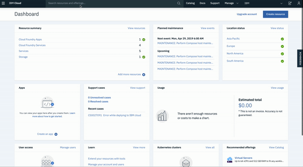

# Watson Visual Recognition iOS App

This is an iOS application that showcases various features available in Watson visual recognition service in IBM Cloud. The app features detection of faces, explicits, food and others in an image.

## Architecture


## Flow

1. User opens up the app in iOS based mobile phone and chooses the different ways (faces, explicit, food etc.) they can classify images.
2. Visual Recognition service in IBM cloud classifies and provides with the classification results.

## Steps

1. [Clone the repo](#1-clone-the-repo)
2. [Carthage dependency installation](#2-carthage-dependency-installation)
3. [Setup Visual Recognition credentials](#3-setup-visual-recognition-credentials)
4. [Install Xcode and run the App](#4-install-xcode-and-run-the-app)

### 1. Clone the repo
`git clone` the repo and `cd` into it by running the following command:

```bash
git clone github.com/IBM/watson-visual-recognition-ios.git &&
cd watson-visual-recognition-ios
```

### 2. Carthage dependency installation
You can install Carthage with [Homebrew](http://brew.sh/):

```bash
brew install carthage
```

If your project does not have a Cartfile yet, generate a Cartfile with the Watson Developer Cloud Swift SDK: 

```
echo 'github "watson-developer-cloud/swift-sdk" ~> 1.4.0' > Cartfile
```

Then run the following command to build the dependencies and frameworks:

```bash
carthage update --platform iOS
```

### 3. Setup Visual Recognition credentials

Go to [IBM Cloud](https://cloud.ibm.com) and sign up if you haven't done so. Search for `Visual Recognition` in catalog search and create one using the lite plan. Copy the `apikey` from the credentials to use it for later.



Add your Visual Recognition API key to the [`Credentials.plist`](https://github.com/IBM/watson-visual-recognition-ios/blob/master/Core%20ML%20Vision/Credentials.plist):
```plist
<key>apiKey</key>
<string>YOUR_API_KEY</string>
```

### 4. Install Xcode and run the app
In order to develop for iOS we need to first install the latest version of Xcode, which can be found on the [Mac App Store](https://itunes.apple.com/us/app/xcode/id497799835?mt=12)

#### Open the project with Xcode
Launch Xcode and choose **Open another project...**


Then in the file selector, choose `Core ML Vision`.

or from the `Terminal`, run `open Core\ ML\ Vision.xcodeproj`

#### Test the application in the simulator
Now we’re ready to test! First we’ll make sure the app builds on our computer, if all goes well, the simulator will open and the app will display.

To run in the simulator, select an iOS device from the dropdown and click **run**.


### Run the app on an iOS device
Since the simulator does not have access to a camera, and the app relies on the camera to test the classifier, we should run it on a real device.

1. Select the project editor (*The name of the project with a blue icon*)
1. Under the **Signing** section, click **Add Account**

1. Login with your Apple ID and password

1. *You should see a new personal team created*
1. Close the preferences window

Now we have to create a certificate to sign our app with

1. Select **General**
1. Change the **bundle identifier** to `com.<YOUR_LAST_NAME>.Core-ML-Vision`

1. Select the personal team that was just created from the **Team** dropdown
1. Plug in your iOS device
1. Select your device from the device menu to the right of the **build and run** icon
1. Click **build and run**
1. On your device, you should see the app appear as an installed appear
1. When you try to run the app the first time, it will prompt you to approve the developer
1. In your iOS settings navigate to ***General > Device Management***
1. Tap your email, tap **trust**

Now you're ready to run the app!


## Demo


# License

This code pattern is licensed under the Apache License, Version 2. Separate third-party code objects invoked within this code pattern are licensed by their respective providers pursuant to their own separate licenses. Contributions are subject to the [Developer Certificate of Origin, Version 1.1](https://developercertificate.org/) and the [Apache License, Version 2](https://www.apache.org/licenses/LICENSE-2.0.txt).

[Apache License FAQ](https://www.apache.org/foundation/license-faq.html#WhatDoesItMEAN)
